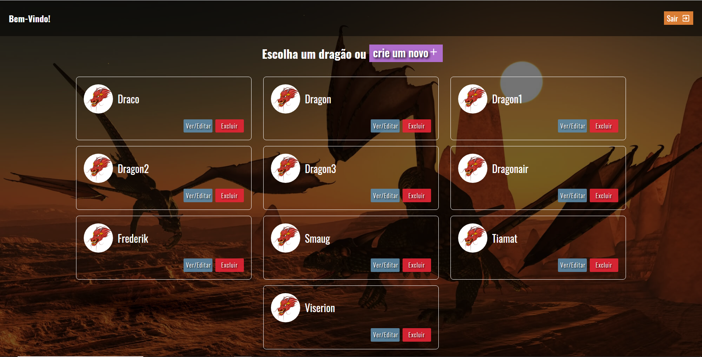
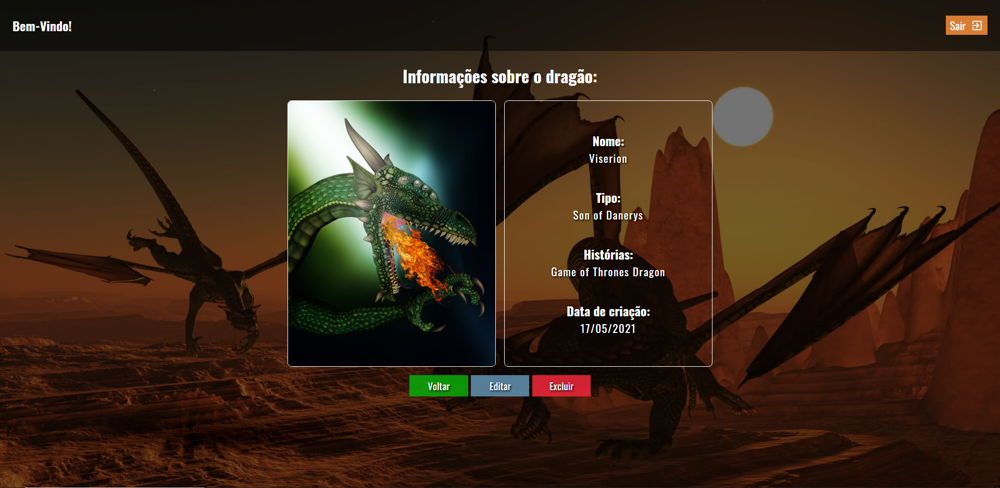
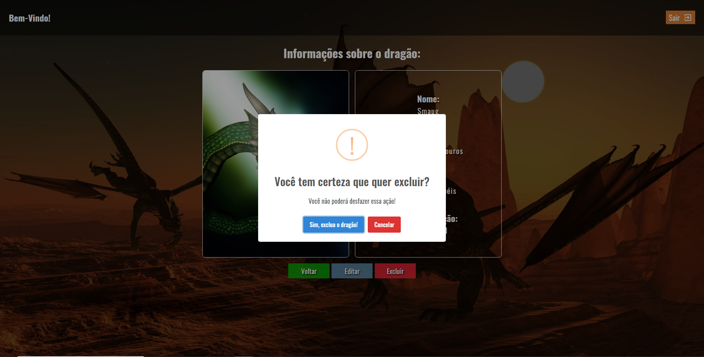
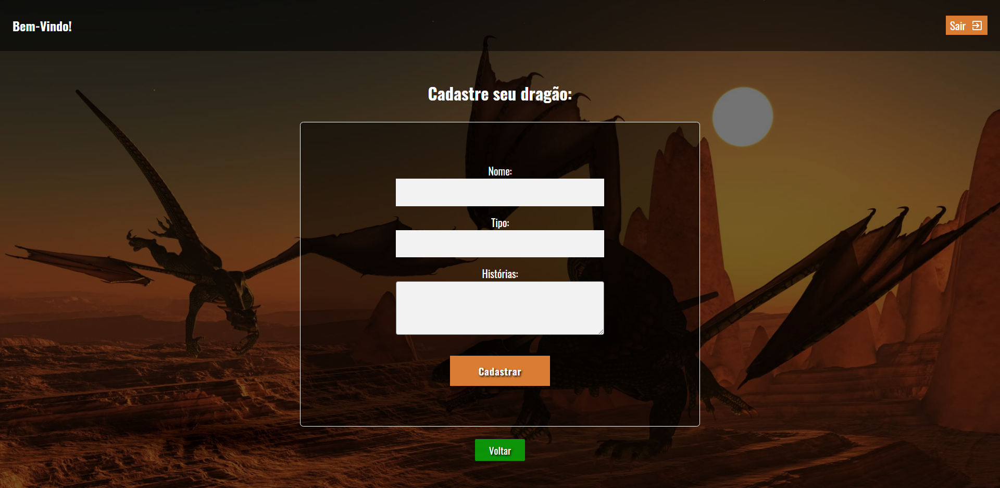
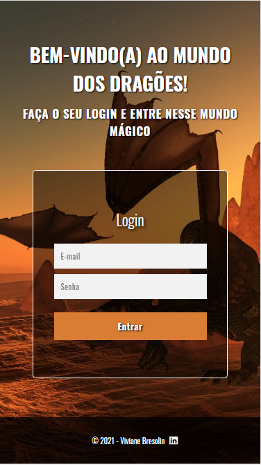
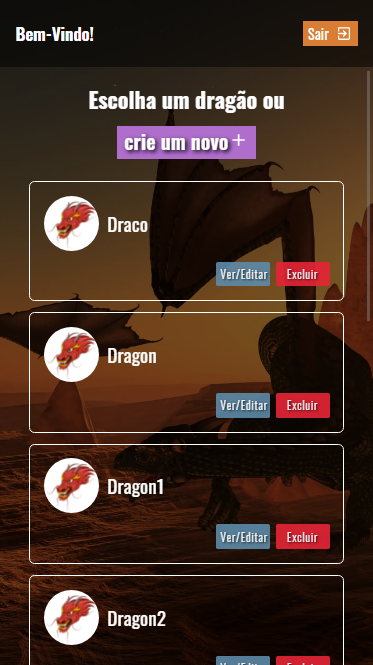
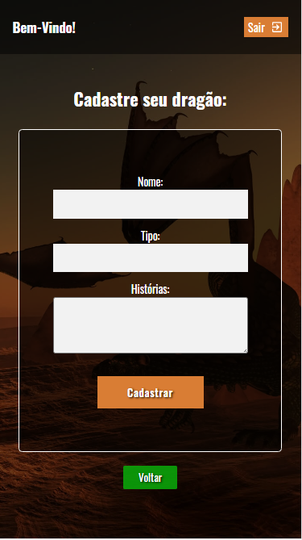
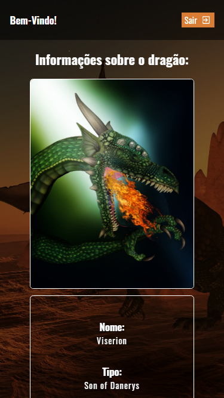
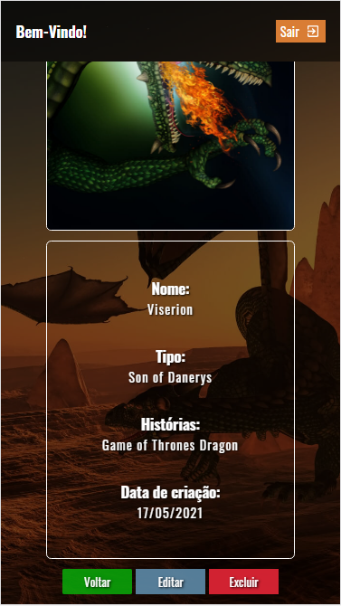

# Frontend Challenge - Dragons

 

  
  
  
  

 

This is a frontend application that consumes an API, developed based on the guidelines provided in this link: [Web Developer Test](https://github.com/WoopSicredi/jobs/issues/6/).

If you want to view the application directly in your browser (computer or cellphone), just access this link
https://dragons-vvbresolin.netlify.app/ and log in with the following information:

- E-mail: admin@admin.com
- Password: 4321

 

## :hammer_and_wrench: Features:

- Login page;
- Main page with an alphabetical listing of dragons;
- Information details about a dragon chosen by the user;
- Registering a new dragon;
- Ability to edit dragon details;
- Ability to delete a dragon (after a confirmation message).

 

## Application images

### Login

 

### Homepage

 

### Dragon details

 

### Delete a dragon

 

### Register a new dragon

 

### Mobile friendly

  

## :man_technologist: Technologies and tools used:

- React
- Typescript
- CSS / SASS
- Sweet Alert 2
- Context API
- Axios
- VS Code
- Netlify

  

## Running the project locally:

To run this application on your local machine, download or clone the project, and then:

1 - o download the dependencies:

### `yarn install`

2 - PTo start the application:

### `yarn start`

3 - Open [http://localhost:3000](http://localhost:3000) to view it in the browser.

  
  

Made with 🧡 and :coffee: | Find me on <a href="https://www.linkedin.com/in/vivianebresolin/"> LinkedIn</a>

